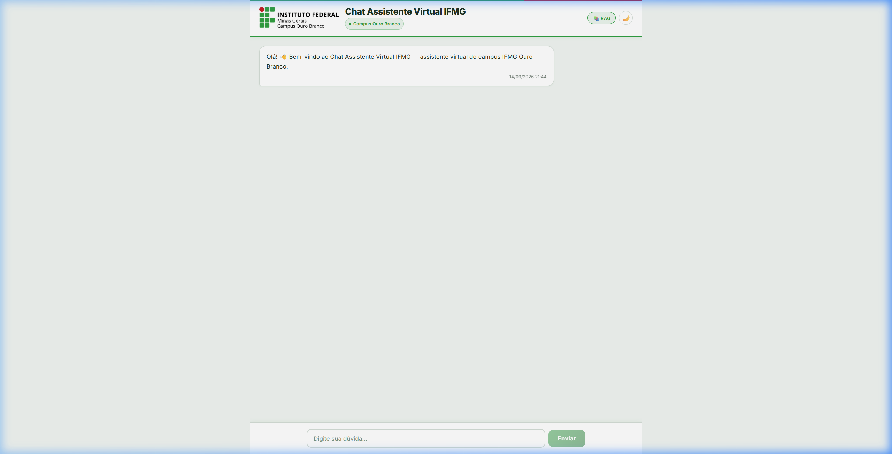
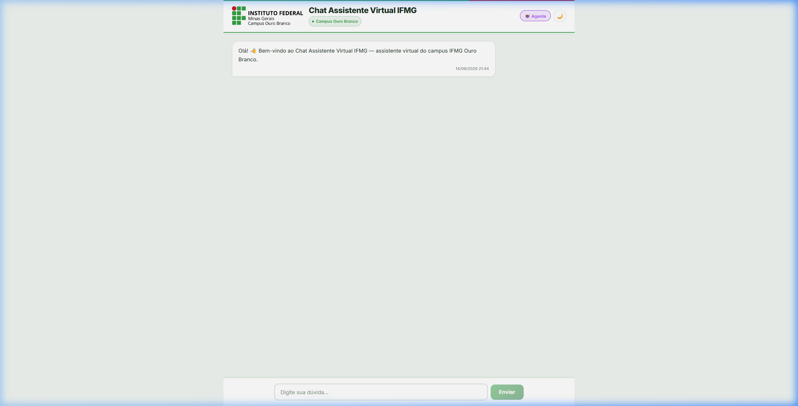

# Roteiro de Teste e Tutorial de Avaliação do Chat Assistente Virtual IFMG
**Projeto de Conclusão de Curso (TCC) — IFMG Campus Ouro Branco**  
**Autores:** Daniel G. D. Silva, Ederson N. F. G. Júnior  
**Endereço da Aplicação:** [https://chat.danielgsilva.com.br/](https://chat.danielgsilva.com.br/)

---

## Sumário
1. [Apresentação e Objetivo do Teste](#1-apresentação-e-objetivo-do-teste)
2. [Tutorial Passo a Passo de Uso do Chat](#2-tutorial-passo-a-passo-de-uso-do-chat)
   - [2.1 Visão Geral da Interface](#21-visão-geral-da-interface)
   - [2.2 Modo RAG Clássico (📚)](#22-modo-rag-clássico-)
   - [2.3 Modo Agente MCP (🤖)](#23-modo-agente-mcp-)
   - [2.4 Alternando entre os Modos](#24-alternando-entre-os-modos)
   - [2.5 Como Registrar Feedback Individual nas Respostas (👍 / 👎)](#25-como-registrar-feedback-individual-nas-respostas---)
3. [Sugestão de Perguntas Acadêmicas para Testar](#3-sugestão-de-perguntas-acadêmicas-para-testar)
4. [Roteiro do Formulário de Avaliação (Questionário de 10 Perguntas)](#4-roteiro-do-formulário-de-avaliação-questionário-de-10-perguntas)
   - [Estrutura e Justificativa Metodológica](#estrutura-e-justificativa-metodológica)
   - [As 10 Questões do Formulário](#as-10-questões-do-formulário)
5. [Orientações para Tabulação e Uso dos Resultados no TCC](#5-orientações-para-tabulação-e-uso-dos-resultados-no-tcc)

---

## 1. Apresentação e Objetivo do Teste

Este guia foi elaborado para orientar os participantes do grupo piloto de testes do **Chat Assistente Virtual IFMG** (Campus Ouro Branco). O sistema é fruto de uma pesquisa de Trabalho de Conclusão de Curso (TCC) focada em inteligência artificial aplicada ao atendimento discente sob infraestrutura 100% local e aberta.

O assistente permite responder a dúvidas sobre normas acadêmicas, Projetos Pedagógicos de Curso (PPC), matrizes curriculares, estágios, regulamentos de TCC e trâmites institucionais, sem a necessidade de ler arquivos PDF extensos.

O diferencial do projeto é a coexistência de **duas abordagens técnicas de inteligência artificial** que podem ser alternadas com um clique pelo usuário:
1. **Modo RAG Clássico (`📚 RAG`):** Arquitetura linear e determinística. Realiza busca direta no banco de dados vetorial dos regulamentos e sintetiza a resposta de forma objetiva e com menor latência.
2. **Modo Agente MCP (`🤖 Agente`):** Arquitetura agêntica governada pelo *Model Context Protocol* (MCP). O modelo atua como um agente autônomo, decidindo quando acionar ferramentas formais de busca e exibindo explicitamente as fontes documentais auditadas que fundamentaram a resposta.

---

## 2. Tutorial Passo a Passo de Uso do Chat

### 2.1 Visão Geral da Interface

Ao acessar [https://chat.danielgsilva.com.br/](https://chat.danielgsilva.com.br/), a interface do chat é apresentada em tela cheia, com identidade visual oficial do IFMG Campus Ouro Branco:

- **Cabeçalho:** Contém a logo institucional, identificação do campus, o botão de alternância de modo (`📚 RAG` / `🤖 Agente`) e o botão de tema (Modo Claro / Modo Escuro).
- **Área Central de Mensagens:** Histórico da conversa, exibindo as perguntas enviadas e as respostas do assistente com formatação rica (Markdown, listas, tabelas e destaques).
- **Rodapé de Entrada:** Campo de digitação de texto com botão "Enviar". Durante o processamento da resposta, o campo é bloqueado temporariamente para evitar concorrência desnecessária.

---

### 2.2 Modo RAG Clássico (📚)

Por padrão, a aplicação inicia no **Modo RAG Clássico**. Neste modo, o botão no canto superior direito é exibido na cor verde com o ícone de livros:

```
[ 📚 RAG ]  (Botão Verde no Topo Direito)
```

#### Características do Modo RAG:
- **Alta Agilidade:** As respostas iniciam o fluxo de digitação em tempo real (*streaming*) de forma quase imediata (baixa latência).
- **Respostas Diretas:** O sistema foca em responder objetivamente à pergunta formulada.
- **Selo na Mensagem:** Cada mensagem gerada exibe o selo inferior `⚡ Modo: RAG Clássico`.

#### Captura de Tela — Modo RAG Inicial:


---

### 2.3 Modo Agente MCP (🤖)

Ao clicar no botão de alternância, o sistema passa para o **Modo Agente MCP**. O botão adota a cor roxa com o ícone de robô:

```
[ 🤖 Agente ]  (Botão Roxo no Topo Direito)
```

#### Características do Modo Agente:
- **Raciocínio Estruturado:** O modelo analisa a consulta, formula argumentos para a ferramenta de busca via MCP e sintetiza as evidências retornadas.
- **Indicador de Status do Pipeline:** Durante a busca, o sistema exibe mensagens de status dinâmico (ex: `Analisando pergunta...`, `Consultando base normativa...`).
- **Exibição Explícita de Fontes:** As respostas incluem metadados com as resoluções e PPCs utilizados, sinalizados pela seção `📚 Fontes: [PPC BSI] [Regulamento Didático]`.
- **Selo na Mensagem:** Cada resposta é demarcada com a etiqueta `🤖 Modo: Agente MCP`.

#### Captura de Tela — Modo Agente Ativo:


---

### 2.4 Alternando entre os Modos

Para comparar o desempenho e o estilo de resposta entre as duas abordagens:
1. **Passo 1:** Digite sua pergunta no modo inicial (`📚 RAG`) e clique em **Enviar**.
2. **Passo 2:** Aguarde a conclusão da resposta e leia o conteúdo gerado.
3. **Passo 3:** Clique no botão de alternância no canto superior direito. Ele mudará de `📚 RAG` (verde) para `🤖 Agente` (roxo).
4. **Passo 4:** Envie a mesma pergunta (ou uma consulta correlata) e compare:
   - A velocidade de início da digitação;
   - A profundidade e o estilo do texto gerado;
   - A presença das tags de fontes consultadas ao final da resposta.

> **Observação:** Durante a geração de uma resposta (enquanto o texto estiver sendo gerado via *streaming*), o botão de alternância e o campo de digitação ficam desabilitados para preservar a estabilidade da sessão.

---

### 2.5 Como Registrar Feedback Individual nas Respostas (👍 / 👎)

Abaixo de cada resposta fornecida pelo assistente, há dois botões de avaliação rápida:
- **👍 (Útil / Correta):** Indica que a resposta foi precisa, clara e ajudou a esclarecer a dúvida.
- **👎 (Não útil / Incorreta):** Indica que a resposta continha imprecisão, não respondeu à pergunta ou omitiu regras essenciais.

Ao clicar em um dos botões, seu voto é registrado instantaneamente no banco de dados do projeto, auxiliando no cálculo da taxa de aprovação para a pesquisa do TCC.

---

## 3. Sugestão de Perguntas Acadêmicas para Testar

Para que o teste explore as diferentes capacidades de recuperação semântica e normativa do sistema, recomendamos formular perguntas com base nos seguintes tópicos reais do campus:

### Bloco A: Disciplinas, Ementas e Pré-requisitos
- *"Quais são os pré-requisitos para cursar Banco de Dados I no curso de Sistemas de Informação?"*
- *"Qual é a carga horária e a ementa da disciplina de Inteligência Artificial?"*
- *"Quais disciplinas compõem o 4º período da matriz de BSI?"*

### Bloco B: Regulamento de TCC e Estágio
- *"Quais são as etapas e prazos para a entrega do projeto de TCC?"*
- *"Quantas horas mínimas de estágio supervisionado são obrigatórias para conclusão do curso?"*
- *"Quem pode ser o orientador do meu trabalho de conclusão de curso?"*

### Bloco C: Normas Gerais de Ensino e Trâmites Acadêmicos
- *"Como funciona o processo de trancamento total de matrícula e qual o prazo regulamentar?"*
- *"Quantas horas de Atividades Complementares de Graduação (ACG) preciso integralizar?"*
- *"Qual é a média mínima para aprovação direta em uma disciplina e como funciona o exame final?"*

---

## 4. Roteiro do Formulário de Avaliação (Questionário de 10 Perguntas)

### Estrutura e Justificativa Metodológica
O formulário de coleta de dados foi projetado para ser objetivo, rápido de preencher (cerca de 3 a 5 minutos) e aderente aos modelos de aceitação tecnológica (TAM — *Technology Acceptance Model*) e usabilidade, dividindo-se em:
- **Perfil do Respondente (Q1):** Contextualização acadêmica.
- **Avaliação do Modo RAG Clássico (Q2 e Q3):** Latência percebida e assertividade objetiva.
- **Avaliação do Modo Agente MCP (Q4):** Profundidade e nível de detalhamento do agente.
- **Demandas Informais e Escopo Não Documentado (Q5):** Identificação de dúvidas do cotidiano não formalizadas em documentos oficiais.
- **Avaliação Factual e Ausência de Alucinações (Q6):** Verificação de fidelidade normativa.
- **Comparativo Direto de Preferência (Q7):** Análise de *trade-off* prático entre os modelos.
- **Usabilidade e Impacto Institucional (Q8 e Q9):** Facilidade da interface e utilidade percebida.
- **Feedback Aberto (Q10):** Coleta de anomalias, falhas ou sugestões de expansão.

---

### As 10 Questões do Formulário

#### [Questão 1] — Perfil do Usuário
**Pergunta:** Qual é o seu curso / vínculo no IFMG Campus Ouro Branco?  
- **Tipo:** Múltipla Escolha / Seleção Única.  
- **Opções:**
  - [ ] Bacharelado em Sistemas de Informação
  - [ ] Bacharelado em Administração
  - [ ] Engenharia Metalúrgica
  - [ ] Licenciatura em Pedagogia
  - [ ] Cursos Técnicos Integrados / Subsequentes
  - [ ] Docente ou Servidor Técnico-Administrativo

---

#### [Questão 2] — Desempenho e Rapidez no Modo RAG Clássico (📚)
**Pergunta:** Em relação à agilidade e rapidez de resposta no Modo RAG Clássico, como você avalia o tempo decorrido até o início e término da resposta?  
- **Tipo:** Escala Likert de 5 pontos.  
- **Opções:**
  - (1) Muito lento / Demora excessiva
  - (2) Lento
  - (3) Aceitável / Regular
  - (4) Rápido
  - (5) Muito rápido / Quase instantâneo

---

#### [Questão 3] — Qualidade e Precisão no Modo RAG Clássico (📚)
**Pergunta:** As respostas geradas no Modo RAG Clássico foram objetivas, claras e responderam diretamente à dúvida consultada?  
- **Tipo:** Escala Likert de 5 pontos.  
- **Opções:**
  - (1) Discordo totalmente (respostas confusas ou irrelevantes)
  - (2) Discordo parcialmente
  - (3) Neutro / Em partes
  - (4) Concordo parcialmente
  - (5) Concordo totalmente (respostas diretas e precisas)

---

#### [Questão 4] — Profundidade e Completude no Modo Agente MCP (🤖)
**Pergunta:** No Modo Agente, como você avalia a profundidade, a organização e o nível de detalhamento das respostas geradas?  
- **Tipo:** Escala Likert de 5 pontos.  
- **Opções:**
  - (1) Muito superficiais ou inadequadas
  - (2) Pouco detalhadas
  - (3) Nível regular de detalhes
  - (4) Detalhadas e bem estruturadas
  - (5) Muito completas, analíticas e aprofundadas

---

#### [Questão 5] — Demandas do Cotidiano Não Formalizadas em Documentos Oficiais
**Pergunta:** Quais tipos de dúvidas do cotidiano acadêmico você considera que o assistente virtual também deveria responder, mas que normalmente **não constam em documentos oficiais** (PPC, resoluções e regulamentos) da instituição?  
- **Tipo:** Múltipla Escolha (Caixas de Seleção — selecione quantas desejar) com opção aberta.  
- **Opções:**
  - [ ] **Localização física no campus:** Localização de blocos, salas de aula, laboratórios específicos e setores de atendimento.
  - [ ] **Transporte e mobilidade:** Horários de ônibus municipais/intermunicipais, pontos de parada e itinerários de transporte para o campus.
  - [ ] **Alimentação e serviços:** Horários de funcionamento e serviços da cantina / refeitório institucional.
  - [ ] **Contatos diretos e horários de atendimento:** E-mails institucionais, ramais telefônicos e horários de atendimento presencial de docentes e setores administrativos.
  - [ ] **Avisos dinâmicos e eventos:** Notícias sobre eventos acadêmicos, semanas de curso, feiras e avisos rápidos de suspensão ou alteração de aulas.
  - [ ] **Assistência estudantil e bolsas:** Prazos práticos de inscrição para auxílios e bolsas de monitoria/iniciação científica em andamento.
  - [ ] **Outro (especifique):** __________________________________________________

---

#### [Questão 6] — Fidelidade Factual e Ausência de Alucinações
**Pergunta:** Durante os seus testes em ambos os modos, você notou alguma resposta que continha regras inventadas, matérias inexistentes ou informações contrárias aos regulamentos vigentes?  
- **Tipo:** Escolha Única.  
- **Opções:**
  - ( ) Não notei nenhum erro; todas as respostas pareceram corretas e confiáveis.
  - ( ) Sim, percebi informações incorretas apenas no Modo RAG Clássico.
  - ( ) Sim, percebi informações incorretas apenas no Modo Agente MCP.
  - ( ) Sim, percebi respostas incorretas ou inventadas em ambos os modos.
  - ( ) Não sei avaliar se a informação estava 100% correta.

---

#### [Questão 7] — Comparação Direta e Preferência de Uso
**Pergunta:** Comparando as duas experiências — o Modo RAG (mais rápido e conciso) versus o Modo Agente (mais explicativo e com exibição das fontes consultadas) —, qual abordagem você preferiria adotar no seu cotidiano?  
- **Tipo:** Escolha Única.  
- **Opções:**
  - ( ) Prefiro o Modo RAG Clássico (priorizo respostas rápidas e diretas).
  - ( ) Prefiro o Modo Agente MCP (priorizo a segurança das fontes e maior detalhamento).
  - ( ) Gostaria de manter ambos os modos disponíveis para escolher de acordo com a complexidade da dúvida.
  - ( ) Nenhuma das opções me atendeu satisfatoriamente.

---

#### [Questão 8] — Usabilidade da Interface Web
**Pergunta:** Como você avalia a facilidade de navegação e uso da interface web (alternância de modos pelo botão no cabeçalho, botões de feedback 👍/👎, legibilidade e modo escuro/claro)?  
- **Tipo:** Escala Likert de 5 pontos.  
- **Opções:**
  - (1) Muito difícil / Pouco intuitiva
  - (2) Difícil
  - (3) Regular
  - (4) Fácil e agradável
  - (5) Extremamente simples, moderna e intuitiva

---

#### [Questão 9] — Utilidade Institucional e Redução de Gargalos
**Pergunta:** Na sua visão como discente/servidor, em que medida a disponibilização permanente deste assistente virtual reduz a necessidade de comparecimento presencial na coordenação/secretaria ou a leitura manual de arquivos PDF longos?  
- **Tipo:** Escala Likert de 5 pontos.  
- **Opções:**
  - (1) Não reduz em nada
  - (2) Reduz pouco
  - (3) Redução moderada
  - (4) Reduz bastante
  - (5) Reduz expressivamente, proporcionando autonomia imediata para esclarecer regras acadêmicas

---

#### [Questão 10] — Críticas, Elogios e Sugestões de Expansão
**Pergunta:** Espaço aberto: registre dúvidas específicas que o assistente não conseguiu responder, inconsistências observadas ou sugestões para o aprimoramento da ferramenta e do TCC.  
- **Tipo:** Texto longo (parágrafo aberto / resposta discursiva opcional).

---

## 5. Orientações para Tabulação e Uso dos Resultados no TCC

As respostas obtidas por meio deste instrumento permitirão enriquecer diretamente a **Seção 4 (Experimentos e Resultados)** do artigo do TCC com evidências empíricas de campo:

1. **Gráficos de Escala Likert (Questões 2, 3, 4, 8 e 9):**
   - Calcular média ($\mu$) e desvio-padrão ($\sigma$) para cada dimensão avaliada.
   - Gerar gráficos de barras divergentes (100% empilhadas) para ilustrar a percepção de utilidade e usabilidade dos discentes.
2. **Taxa de Fidelidade Factual (Questão 6):**
   - Cruzar o percentual de respostas sem alucinação com os registros da tabela `chat_feedbacks` da aplicação para consolidar a confiabilidade do sistema.
3. **Preferência de Paradigma (Questão 7):**
   - Fornecer dados quantitativos reais para a discussão do *trade-off* entre RAG Clássico (baixa latência) e RAG Agêntico via MCP (rastreabilidade de contexto), validando as conclusões do trabalho sob modelos de linguagem compactos (4 bilhões de parâmetros).
4. **Mapeamento de Novas Demandas Não Normativas (Questão 5):**
   - Quantificar as principais carências de informação não oficial (transporte, localização, contatos, cardápio) e incorporar na seção de Trabalhos Futuros do TCC como justificativa para desenvolvimento de novas ferramentas MCP conectadas a fontes dinâmicas externas (APIs de horários, feeds de notícias ou calendários).
