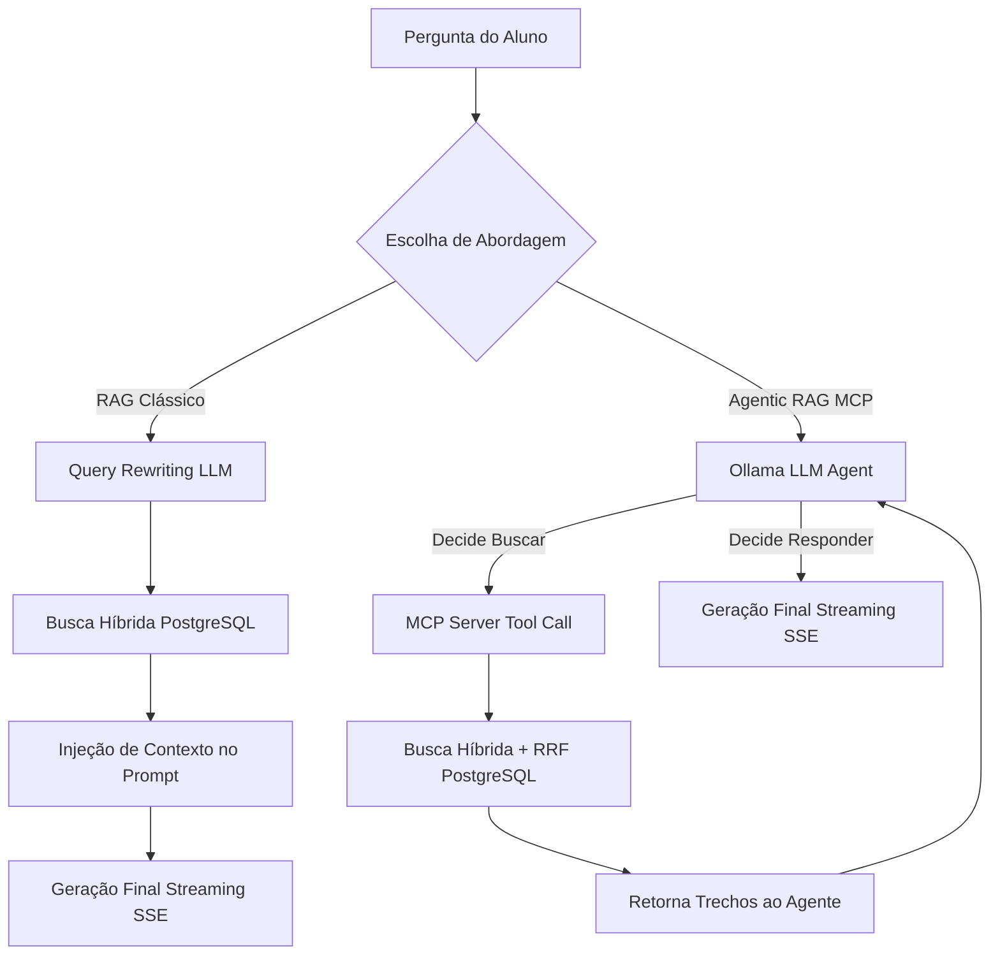

# Guia de Redação e Desenvolvimento do TCC 📝🎓

Este documento serve como material de apoio e diretriz para continuar o desenvolvimento do texto do seu TCC (monografia). Ele faz a ponte entre a teoria acadêmica descrita no seu artigo/monografia e as decisões reais de arquitetura e implementação adotadas no repositório do **Chat Assistente Virtual IFMG**.

---

## 📌 1. Ajustes Necessários na Fundamentação Teórica (Seção 3)

### 1.1. Equação do RRF Ponderado (Seção 3.3)
No texto atual do TCC, substitua a Equação 1 clássica pela variação ponderada utilizada no código, justificando a flexibilidade dada ao pipeline de busca.

* **Fórmula Ponderada a Inserir:**
  $$Score_{RRF}(d \in D) = \alpha \cdot \frac{1}{k + rank_{sem\hat{a}ntico}(d)} + (1 - \alpha) \cdot \frac{1}{k + rank_{lexical}(d)}$$

* **Texto de Justificativa Teórica:**
  > "Diferente da abordagem clássica do RRF que atribui peso idêntico a ambos os rankings, este trabalho introduz um hiperparâmetro de ponderação $\alpha \in [0,1]$. Isso permite calibrar a relevância de acordo com a abordagem adotada:
  > * No **RAG Clássico**, utiliza-se $\alpha = 0.5$ para obter um equilíbrio idêntico entre busca conceitual e correspondência de termos.
  > * Na busca do **Servidor MCP**, utiliza-se $\alpha = 0.4$, conferindo um peso ligeiramente superior (0.6) à busca lexical, garantindo maior precisão na recuperação de siglas ou termos específicos sob a governança da ferramenta de agente."

### 1.2. Especificação do HNSW vs. IVFFlat (Seção 3.3)
Explique por que o HNSW foi adotado no banco de dados.

* **Texto Sugerido:**
  > "Para a indexação dos embeddings de 1024 dimensões no PostgreSQL, utilizou-se a extensão pgvector configurada com o índice Hierarchical Navigable Small World (HNSW). O HNSW organiza os vetores em um grafo multicamadas, permitindo buscas aproximadas de vizinhos mais próximos (ANN) com complexidade logarítmica. Ele foi preferido ao IVFFlat (Inverted File Flat) por não requerer uma fase de treinamento prévio e por manter alta revocação (recall) e baixa latência mesmo sob atualizações frequentes de documentos na base de conhecimento acadêmica."

---

## 🏗️ 2. Esboço de Redação: Seção 4 — Metodologia

Esta seção deve descrever a arquitetura do monorepo e o tratamento de dados.

### 4.1. Duas Abordagens Comparativas
Explique que o sistema implementa duas arquiteturas concorrentes para fins de análise comparativa de viabilidade em hardware modesto local:
1. **Pipeline RAG Linear (Clássico):** Recebe a pergunta, reescreve a query com sigla expandida, vetoriza com o modelo `bge-m3`, faz busca híbrida no PostgreSQL com RRF e gera a resposta em streaming SSE via Express.
2. **Pipeline Agentic RAG (MCP):** Centraliza a busca como uma ferramenta (`search_ifmg_knowledge`) em um servidor MCP autônomo. O LLM atua como agente e decide dinamicamente, por meio de *Function Calling*, se precisa buscar dados ou responder diretamente.

### 4.2. O Pipeline de Ingestão e Sanitização de Documentos
Detalhamento de como os arquivos do IFMG (PDFs de regulamentos, ementas, tabelas) são processados e limpos para evitar a poluição do banco vetorial:

1. **Extração Avançada:** Processamento de PDFs e imagens usando IA de visão espacial (`@llamaindex/liteparse`) e OCR local (`tesseract.js`). Planilhas são convertidas nativamente para tabelas no formato Markdown.
2. **Sanitização de Texto (8 Etapas):**
   * *Etapa 1 (Limpeza OCR):* Remoção de caracteres invisíveis e lixo de decodificação Unicode.
   * *Etapa 2 (Reconstituição de Hifenização):* União inteligente de palavras truncadas por quebra de linha.
   * *Etapa 3 (Remoção Institucional):* Exclusão de termos burocráticos repetitivos ("Ministério da Educação", cabeçalhos padrão do IFMG).
   * *Etapa 4 (Poda de Anexos):* Corte automático ao achar termos de formulários vazios (`ANEXO I`), eliminando ruído do RAG.
   * *Etapa 5 (Conversão de Tabelas):* Normalização de dados tabulares para texto corrido, garantindo que códigos e nomes de disciplinas compartilhem o mesmo vetor de contexto.
   * *Etapa 6 (Limpeza Estrutural):* Remoção de numeração isolada e pilcrows.
   * *Etapa 7 (Preparação Jurídica):* Junção de linhas isoladas de artigos e injeção de quebras duplas (`\n\n`) antes de marcadores legais (`Art.`, `CAPÍTULO`), otimizando a divisão lógica do split.
   * *Etapa 8 (Normalização Final):* Remoção de múltiplos espaços e linhas curtas.
3. **Chunking Semântico Adaptativo:** Roteamento de fragmentação baseado no formato detectado (estratégia Jurídica preservando Artigo+Inciso, estratégia de Tabelas replicando cabeçalhos nos sub-chunks, ou Geral por parágrafo).
4. **Contexto Global Prefixado:** Injeção de metadados no início de cada vetor, ex: `[Documento: PPC SI 2023 | Contexto: CAPÍTULO II]`, impedindo a perda de contexto semântico na indexação vetorial.

### 4.3. Semáforo de VRAM para Mitigação de OOM
Explique como o sistema resolve o limite de processamento concorrente do homelab:
> "Devido às restrições de VRAM física do homelab (GPU dedicada local), o processamento simultâneo de múltiplos prompts de inferência pesados causaria travamentos no daemon do Ollama (*Out of Memory*). Para mitigar essa vulnerabilidade de infraestrutura, implementou-se um Semáforo de Concorrência via Express (`queue.service.ts`). O mecanismo gerencia o fluxo através de um padrão *acquire/release* limitando as inferências simultâneas ao máximo parametrizado. As requisições excedentes são colocadas em espera segura em uma fila de memória com timeout."

---

## 📊 3. Esboço de Redação: Seção 5 — Experimentos e Resultados

Nesta seção, você deve analisar o desempenho obtido com a execução local.

### 5.1. Métricas de Latência do Pipeline RAG
Você pode apresentar tabelas de tempo de resposta com base nas métricas reais salvas no console do servidor:

| Etapa | Responsabilidade | Latência Média (ms) |
|---|---|---|
| **Query Rewriting** | Expansão de siglas e classificação de intenção (Qwen 4B) | ~800 - 1500 ms |
| **Vetorização** | Geração de embedding denso 1024d (BGE-M3) | ~100 - 300 ms |
| **Busca Híbrida** | Consulta PostgreSQL HNSW + FTS + RRF | ~50 - 120 ms |
| **Geração de Resposta** | Streaming token a token SSE (Qwen 4B) | ~3000 - 6000 ms |

### 5.2. Discussão Teórica: O Gargalo dos Modelos Locais Pequenos (Tool Calling)
Esta subseção é vital para demonstrar maturidade acadêmica e senso crítico sobre a técnica de Agentes:
* **O Problema:** Modelos locais com menos de 8 bilhões de parâmetros (como o `qwen3.5:4b` de 4B parâmetros utilizado) falham intermitentemente na orquestração MCP.
* **Causas Físicas:**
  1. *Aderência ao Esquema JSON:* Modelos pequenos frequentemente falham em gerar argumentos de ferramentas no formato exato esperado pelo SDK MCP ou esquecem de invocar a tool sob janelas de contexto saturadas.
  2. *Context Bloat:* O histórico de conversas somado ao prompt de sistema do agente esgota rapidamente a janela de contexto de 2048 tokens configurada para economia de VRAM.
  3. *Sensibilidade a Instruções:* Dificuldade em respeitar diretivas negativas de idioma (responder estritamente em pt-BR quando o contexto contém termos acadêmicos em inglês).
* **Conclusão Comparativa:** O RAG Clássico linear se provou muito mais consistente e rápido para o usuário final no hardware disponível, enquanto a abordagem MCP agêntica se apresenta como promissora, mas dependente de hardware superior capaz de rodar modelos locais maiores (ex: Llama-3-8B ou Qwen-2.5-14B).

---

## 🔮 4. Esboço de Redação: Seção 6 — Conclusão e Trabalhos Futuros

Sugestões para encerrar a monografia:
1. **Contribuição Acadêmica:** Demonstração prática de um RAG híbrido hospedado inteiramente local em um homelab universitário, provando a viabilidade de sistemas institucionais soberanos de baixo custo.
2. **Limitações do Estudo:** Dependência do tamanho de parâmetros do modelo de inferência local e restrições de processamento de GPU concorrente.
3. **Trabalhos Futuros:**
   * Implementação de uma arquitetura multiagente cooperativa (usando frameworks como CrewAI ou LangGraph) acoplados ao MCP.
   * Teste de modelos de 8B ou 14B parâmetros quantizados para avaliar o ponto de virada da qualidade do Tool Calling do MCP.
   * Avaliação sistemática automática do RAG utilizando frameworks como o RAGAS (Rag Assessment) para cálculo científico de métricas de fidelidade (faithfulness) e relevância do contexto.
